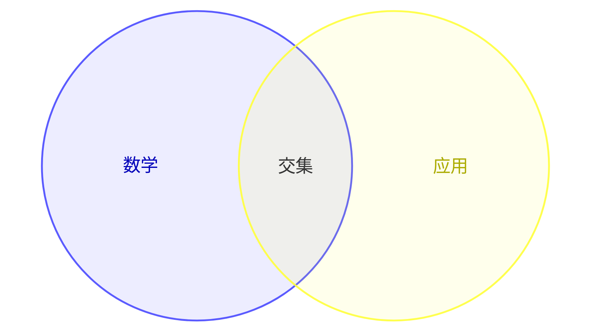

# 数学导出测试

上文 **粗体** 与 $x^2+1$。

$$
\int_0^1 x^2\,dx=\frac{1}{3}
$$



```mermaid
venn-beta
set A["数学"]
set B["应用"]
union A,B["交集"]
```


```mermaid
treeView-beta
    notes/
        HJB.md
```

```js
const value = 1;
```

| 标题 | 值 |
| --- | --- |
| 测试 | 42 |

[外部链接](https://example.org)
